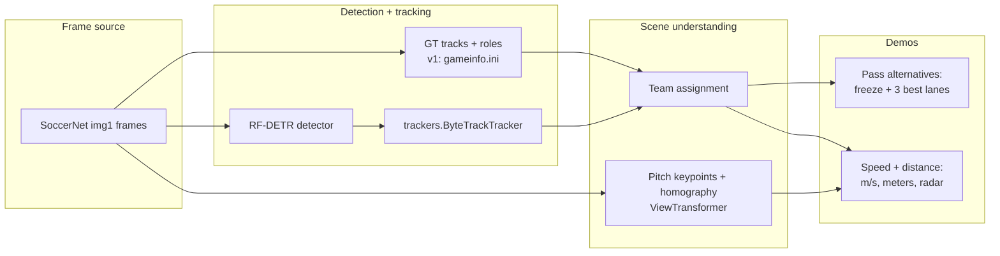

# World Cup Tracker Demos

**Single canonical copy:** `world_cup_projects/` (in the Roboflow monorepo or as its own
git root for publication). The duplicate export folder `world-cup-tracker-demos/` was
removed.

Two shareable football-analytics demos that promote the Roboflow
[`trackers`](https://github.com/roboflow/trackers) library, riding the World Cup hype.
Both reuse what we already built at Roboflow (`trackers`, RF-DETR,
[`roboflow/sports`](https://github.com/roboflow/sports)) and run on the **SoccerNet**
dataset to avoid FIFA copyright-strike risk on real broadcast footage.

1. **Pass Alternatives** - freeze the frame when a player has the ball and overlay the 3
   best passing lanes, scored by openness / forward-progress / receiver-space.
2. **Player Speed & Distance** - per-player speed (km/h) + total distance covered, shown as
   on-pitch labels, an end-of-clip leaderboard, and (v2) a top-down radar minimap.

Status: **both demos are built and produce rendered MP4s.** v1 (no weights) and v2
(RF-DETR + ByteTrack + pitch homography) both run end-to-end.

## Quick start

**Inside the Roboflow monorepo** (data auto-detected under `trackers metrics/...`):

```bash
pip install -r world_cup_projects/requirements.txt
pip install -e trackers
PYTHONPATH=. python -m world_cup_projects.pass_alternatives.run --sequence SNMOT-194
```

**Standalone** (clone or publish this folder as the repo root):

```bash
cd world_cup_projects   # or rename the repo root to match your remote
python -m venv .venv && source .venv/bin/activate
pip install -e ".[full]"
pip install git+https://github.com/roboflow/trackers.git

export SOCCERNET_TRACKING_ROOT=/path/to/soccernet/tracking
# or: ln -s /your/path data/soccernet/tracking

python -m world_cup_projects.pass_alternatives.run --sequence SNMOT-194 --metric --carrier-max-m 0.7
python -m world_cup_projects.player_stats.run --sequence SNMOT-117 --mode homography
python -m world_cup_projects.player_stats.analyze_velocities --sequence SNMOT-117
```

v2 extras: `rfdetr`, `ultralytics`, `gdown` (included in `[full]`).

Monorepo commands (same demos, `PYTHONPATH=.` from repo root):

```bash
# Demo 1 - pass alternatives (auto-picks the best clip, renders MP4 + JSON manifest)
PYTHONPATH=. python -m world_cup_projects.pass_alternatives.run --sequence SNMOT-194

# rank clips only (no render)
PYTHONPATH=. python -m world_cup_projects.pass_alternatives.run --rank-only

# Demo 2 - speed & distance, metric (pitch homography + radar)
PYTHONPATH=. python -m world_cup_projects.player_stats.run --sequence SNMOT-194 --mode homography

# Demo 2 - weight-free fallback (bbox-height calibration)
PYTHONPATH=. python -m world_cup_projects.player_stats.run --sequence SNMOT-194 --mode height

# Homography debug: pitch keypoints, skeleton, feet warp check (orange line = bad H)
PYTHONPATH=. python -m world_cup_projects.player_stats.run --sequence SNMOT-117 --mode homography --debug-pitch-keypoints
PYTHONPATH=. python -m world_cup_projects.pass_alternatives.run --sequence SNMOT-194 --metric --debug-pitch-keypoints

# v2 "from raw pixels" — DFL football-players-detection (ball/player/gk/referee)
PYTHONPATH=. python -m world_cup_projects.pass_alternatives.run \
    --video world_cup_projects/bundesliga_videos/08fd33_0.mp4 --metric --pitch-confidence 0.90

# v2 fallback: generic COCO RF-DETR (poor team/role split; not recommended for video)
RF_HOME=world_cup_projects/weights/rfdetr PYTHONPATH=. \
    python -m world_cup_projects.player_stats.run --sequence SNMOT-194 --source rfdetr --max-frames 150
```

There is also a walkthrough notebook: [`world_cup_demos.ipynb`](world_cup_demos.ipynb)
(SoccerNet-notebook style; previews stills inline and renders both demos).

## Rendered outputs (in `assets/`, gitignored)

| File | Demo | Source / calibration |
|------|------|----------------------|
| `player_stats_gt_homography_SNMOT-194.mp4` | Speed/distance + radar (hero) | GT + pitch homography |
| `pass_alternatives_gt_metric_SNMOT-194.mp4` | Top-3 passing lanes, metric | GT + pitch homography |
| `pass_alternatives_gt_SNMOT-194.mp4` | Top-3 passing lanes, pixel space | GT (no weights) |

Each MP4 ships a matching `.json` manifest (freeze events / leaderboard) and is
re-encoded to h264 (`ffmpeg -c:v libx264 -crf 23 -pix_fmt yuv420p`) so it stays small and
broadly playable.

## Visual style (Roboflow Football-AI look)

Both demos share `common/visual.py`, which mirrors Roboflow's Football-AI / blog aesthetic
using `supervision` annotators:

- **Players**: `sv.EllipseAnnotator` at the feet, team-colored via a `ColorPalette` +
  `ColorLookup.CLASS`.
- **Labels**: `sv.LabelAnnotator` rounded chips (`border_radius`, `BOTTOM_CENTER`) — e.g.
  `#9  12.0 km/h` in the speed demo.
- **Ball**: `sv.TriangleAnnotator` (gold downward triangle).
- **Radar**: bottom-center pitch minimap over a semi-transparent dark panel, team-colored
  dots with black edges plus a white ball dot (`draw_pitch` / `draw_points_on_pitch`).
- **HUD / branding**: alpha-blended title bar with a Roboflow-purple (`#8315F9`) drop-shadow
  title and a `powered by trackers` tag.
- **Pass freeze**: dimmed background, thick faux-glow ranked arrows (green → yellow →
  orange), an emphasized ring on the best receiver, and rounded score chips.

## Which clip and why

`common.clips.rank_clips` scores every SoccerNet **test** sequence by possession density
(ball glued to a player's feet), player count, and both-teams-present. Top picks:

| Rank | Clip | Why |
|------|------|-----|
| 1 | **SNMOT-194** | ball visible 735/750, clear possession 604 frames, ~18 players, both teams |
| 2 | **SNMOT-117** | homography/radar default — active play; center-circle frames OK, many frames weak @ 0.98 (DFL-trained pitch model) |
| 3 | SNMOT-200 | ball 707/750, possession 529, ~14 players |

We use **SNMOT-194** for pixel-space / possession auto-pick. **Homography demos**
(`--metric`, `player_stats --mode homography`) auto-pick **SNMOT-117** via
`pick_homography_demo_clip`. Auto-pick **skips SNMOT-132, SNMOT-189, SNMOT-197** (bad keypoints)
and **SNMOT-127** (play often stopped)
(broken or poor pitch keypoints; blocked unless `--force-unreliable-pitch`). The minimap uses a **simple
per-frame homography** (`homography_from_keypoints_simple`): fit accepted keypoints to the
pitch template, draw those keypoints on the radar, warp player feet — no mirror/orientation
locking. Metric pass scoring still uses the sequence tracker `H`.

## Why SoccerNet

SoccerNet game-state clips (under `SOCCERNET_TRACKING_ROOT`, or the monorepo mirror at
`trackers metrics/soccernet/soccernet_data/tracking` when present) ship **ground-truth
tracks with role / team / jersey labels** (parsed from `gameinfo.ini`),
so v1 runs with zero model weights.

- 30s clips, `1920x1080`, 25 fps, 750 frames each (`seqinfo.ini`).
- `gt/gt.txt` is standard MOT: `frame,track_id,x,y,w,h,conf,-1,-1,-1`.
- `gameinfo.ini` maps each `track_id` to `player team left|right` / `goalkeeper` /
  `referee` / `ball` + jersey number. Parsed by [`common/soccernet.py`](common/soccernet.py).

## Architecture



### Two tiers

| Tier | Detection / tracking | Calibration | What it shows |
|------|----------------------|-------------|---------------|
| **v1** | SoccerNet GT tracks | image space / bbox-height | Pass lanes + approximate m/s - no weights |
| **v2** | RF-DETR + `trackers.ByteTrackTracker` | pitch keypoint homography -> `ViewTransformer` | True meters / m/s + top-down radar |

## Folder layout

```
world_cup_projects/
  README.md
  requirements.txt
  world_cup_demos.ipynb        # walkthrough notebook
  common/
    soccernet.py               # GT loader (roles/teams/jersey -> sv.Detections)
    possession.py              # ball-carrier detection
    clips.py                   # auto-pick best clips
    geometry.py                # point-to-segment distance etc.
    pitch.py                   # vendored ViewTransformer + pitch config + radar + PitchHomography
    teams.py                   # team assignment (Siglip TeamClassifier + GK resolution)
    detect.py                  # RF-DETR + ByteTrack pipeline (v2)
  pass_alternatives/
    pass_options.py            # lane scoring (openness / forward / space)
    render.py                  # freeze-frame overlay video
    run.py                     # CLI
  player_stats/
    speed_distance.py          # per-track speed + cumulative distance
    render.py                  # speed labels + leaderboard + radar
    run.py                     # CLI
  weights/rfdetr/              # RF-DETR checkpoint cache (RF_HOME)
  .cache/models/               # pitch keypoint model
  assets/                      # rendered mp4s / json / stills (gitignored)
```

## Demo 1 - Pass Alternatives

1. **Find the carrier** - ball nearest a player's feet (`BOTTOM_CENTER` anchor); carrier's
   team comes from the GT `team` field (or the color/Siglip classifier in v2).
2. **Candidate receivers** - teammates other than the carrier.
3. **Score each lane** carrier -> receiver (`pass_options.score_pass_options`):
   - *openness*: nearest **rival** in a **2.5 m** corridor on the **pitch/radar**
     (metric default). On freeze frames the corridor is drawn on the **main video**
     (projected from pitch via ``H^-1``) and on the minimap; red **!** = rival inside.
     Use ``--pass-lane-image`` to score in pixels instead.
   - *teammate lane*: light penalty in a **narrower** image corridor (0.5 m scaled).
   - *forward progress*: gain toward the attacking direction,
   - *carrier motion*: penalizes passes **behind** the carrier's recent run (GT track
     displacement over ~5 frames),
   - *receiver space*: distance from the receiver to the nearest opponent,
   - minus a range penalty for too-short/too-long passes.
4. **Pick top 3**, draw ranked arrows (green=best -> yellow -> orange) with scores, dim the
   background, hold the freeze ~1.5s. `plan_events` **detects** good pass moments offline:
   every frame with possession is scored; freezes are frames that pass score thresholds,
   are **local peaks** in that score (~±12 frames), and are at least ~90 frames apart.
   No fixed count by default (`--max-events 0`); use `--max-events N` to cap.
   Pitch keypoints use **`--pitch-confidence 0.98`** by default.

In v1 the attacking direction is an image-space proxy (carrier-team centroid ->
opponent-team centroid); v2 uses the pitch homography for a true direction-to-goal.

## Demo 2 - Player Speed & Distance

1. Track every player (GT in v1, RF-DETR + `ByteTrackTracker` in v2); accumulate the
   `BOTTOM_CENTER` feet position per frame.
2. Convert pixel motion to meters:
   - **height** (default, no weights): each player's bbox height (~1.8 m) gives a local
     meters-per-pixel scale that adapts to perspective.
   - **homography**: per-frame `ViewTransformer` from the pitch-keypoint model maps feet to
     true pitch meters (camera-angle independent).
3. **Speed (baseline):** one step `‖H_j(f_j)−H_{j−1}(f_{j−1})‖/Δt`, drop steps >12.5 m/s.
   Optional upgrades (enable one at a time, compare renders):
   `--speed-upgrade-multi-lag --speed-k-frames 15`,
   `--speed-upgrade-adaptive-filter`,
   `--speed-upgrade-feet-smooth`,
   `--speed-display-smooth 7`.

**Radar / speed H:** per-frame confidence-filtered keypoints, orientation locked after
the first good fit; updates gated by reprojection (no cross-frame point stacking).
Goal defending teams are voted during warmup then fixed for the clip.
4. Render per-player km/h labels (team-colored), an end-card leaderboard (top distance + top
   sprint), and a top-down **radar** minimap in homography mode.

## Weights

- **Football players** (`football-player-detection.pt`, ~137 MB): same weights as
  [`football-players-detection-3zvbc`](https://universe.roboflow.com/roboflow-jvuqo/football-players-detection-3zvbc)
  (DFL-trained; classes: ball, goalkeeper, player, referee). Default for `--video` clips
  (e.g. `bundesliga_videos/08fd33_0.mp4`) which have **no SoccerNet-style GT tracks**.
  `common.detect.ensure_football_players_model()` downloads from Google Drive into
  `.cache/models/`.
- **RF-DETR**: auto-downloads on first use. The cache dir defaults to `~/.roboflow`; set
  `RF_HOME=world_cup_projects/weights/rfdetr` to keep it in-repo. Force `device="cpu"` on
  pre-macOS-14 machines (MPS otherwise errors).
- **Pitch keypoint model** (`football-pitch-detection.pt`, ~140 MB, from `roboflow/sports`):
  trained on [DFL Bundesliga Data Shootout](https://www.kaggle.com/competitions/dfl-bundesliga-data-shootout)
  frames ([`football-field-detection-f07vi`](https://universe.roboflow.com/roboflow-jvuqo/football-field-detection-f07vi)),
  not SoccerNet SNMOT clips — expect domain gap on some game-state camera angles.
  `common.pitch.ensure_pitch_model()` downloads it from Google Drive into
  `.cache/models/`. Some sandboxed/CI networks block Google Drive (HTTP 403) - if so, fetch
  it on an open network or drop the `.pt` in `.cache/models/`. When absent, the speed demo
  **falls back to height calibration automatically**.

## Credits

Built on [`trackers`](https://github.com/roboflow/trackers),
[RF-DETR](https://github.com/roboflow/rf-detr), `supervision`, and utilities vendored from
[`roboflow/sports`](https://github.com/roboflow/sports) (Apache-2.0): `ViewTransformer`,
`SoccerPitchConfiguration`, pitch annotators, and `TeamClassifier`.
