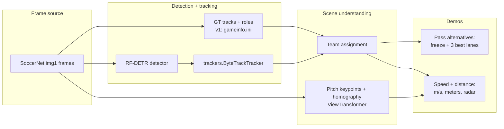

# World Cup Tracker Demos

**Single canonical copy:** `world_cup_projects/` (in the Roboflow monorepo or as its own
git root for publication). The duplicate export folder `world-cup-tracker-demos/` was
removed.

Two shareable football-analytics demos that promote the Roboflow
[`trackers`](https://github.com/roboflow/trackers) library, riding the World Cup hype.
Both reuse what we already built at Roboflow (`trackers`, RF-DETR,
[`roboflow/sports`](https://github.com/roboflow/sports)) and run on the **SoccerNet**
dataset to avoid FIFA copyright-strike risk on real broadcast footage.

1. **Pass Alternatives** - freeze the frame when a player has the ball and overlay the 3
   best passing lanes, scored by openness / forward-progress / receiver-space.
2. **Pass Network** - infer completed passes and turnovers from tracking, score each pass
   with the same lane model, and render a collaboration web + possession-lost banners.
3. **Player Speed & Distance** - per-player speed (km/h) + total distance covered, shown as
   on-pitch labels, an end-of-clip leaderboard, and (v2) a top-down radar minimap.

Status: **both demos are built and produce rendered MP4s.** v1 (no weights) and v2
(RF-DETR + ByteTrack + pitch homography) both run end-to-end.

## Quick start

**Inside the Roboflow monorepo** (data auto-detected under `trackers metrics/...`):

```bash
pip install -r world_cup_projects/requirements.txt
pip install -e trackers
PYTHONPATH=. python -m world_cup_projects.pass_alternatives.run --sequence SNMOT-194
```

**Standalone** (clone or publish this folder as the repo root):

```bash
cd world_cup_projects   # or rename the repo root to match your remote
python -m venv .venv && source .venv/bin/activate
pip install -e ".[full]"
pip install git+https://github.com/roboflow/trackers.git

export SOCCERNET_TRACKING_ROOT=/path/to/soccernet/tracking
# or: ln -s /your/path data/soccernet/tracking

python -m world_cup_projects.pass_alternatives.run --sequence SNMOT-194 --metric --carrier-max-m 0.7
python -m world_cup_projects.player_stats.run --sequence SNMOT-117 --mode homography
python -m world_cup_projects.player_stats.analyze_velocities --sequence SNMOT-117
```

v2 extras: `rfdetr`, `ultralytics`, `gdown` (included in `[full]`).

Monorepo commands (same demos, `PYTHONPATH=.` from repo root):

```bash
# Demo 1 - pass alternatives (auto-picks the best clip, renders MP4 + JSON manifest)
PYTHONPATH=. python -m world_cup_projects.pass_alternatives.run --sequence SNMOT-194

# rank clips only (no render)
PYTHONPATH=. python -m world_cup_projects.pass_alternatives.run --rank-only

# Demo 2 - speed & distance, metric (pitch homography + radar)
PYTHONPATH=. python -m world_cup_projects.player_stats.run --sequence SNMOT-194 --mode homography

# Demo 2 - weight-free fallback (bbox-height calibration)
PYTHONPATH=. python -m world_cup_projects.player_stats.run --sequence SNMOT-194 --mode height

# Homography debug: pitch keypoints, skeleton, feet warp check (orange line = bad H)
PYTHONPATH=. python -m world_cup_projects.player_stats.run --sequence SNMOT-117 --mode homography --debug-pitch-keypoints
PYTHONPATH=. python -m world_cup_projects.pass_alternatives.run --sequence SNMOT-194 --metric --debug-pitch-keypoints

# v2 "from raw pixels" — DFL football-players-detection (ball/player/gk/referee)
PYTHONPATH=. python -m world_cup_projects.pass_alternatives.run \
    --video world_cup_projects/bundesliga_videos/08fd33_0.mp4 --metric

# Pass network — inferred passes + turnovers + optional alternative freezes
PYTHONPATH=. python -m world_cup_projects.player_stats.pass_network_run \
    --video world_cup_projects/bundesliga_videos/08fd33_0.mp4 --metric --render --show-predictions

# v2 fallback: generic COCO RF-DETR (poor team/role split; not recommended for video)
RF_HOME=world_cup_projects/weights/rfdetr PYTHONPATH=. \
    python -m world_cup_projects.player_stats.run --sequence SNMOT-194 --source rfdetr --max-frames 150
```

There is also a walkthrough notebook: [`world_cup_demos.ipynb`](world_cup_demos.ipynb)
(SoccerNet-notebook style; previews stills inline and renders both demos).

## Rendered outputs (in `assets/`, gitignored)

| File | Demo | Source / calibration |
|------|------|----------------------|
| `player_stats_gt_homography_SNMOT-194.mp4` | Speed/distance + radar (hero) | GT + pitch homography |
| `pass_alternatives_gt_metric_SNMOT-194.mp4` | Top-3 passing lanes, metric | GT + pitch homography |
| `pass_alternatives_gt_SNMOT-194.mp4` | Top-3 passing lanes, pixel space | GT (no weights) |

Each MP4 ships a matching `.json` manifest (freeze events / leaderboard) and is
re-encoded to h264 (`ffmpeg -c:v libx264 -crf 23 -pix_fmt yuv420p`) so it stays small and
broadly playable.

## Visual style (Roboflow Football-AI look)

Both demos share `common/visual.py`, which mirrors Roboflow's Football-AI / blog aesthetic
using `supervision` annotators:

- **Players**: `sv.EllipseAnnotator` at the feet, team-colored via a `ColorPalette` +
  `ColorLookup.CLASS`.
- **Labels**: `sv.LabelAnnotator` rounded chips (`border_radius`, `BOTTOM_CENTER`) — e.g.
  `#9  12.0 km/h` in the speed demo.
- **Ball**: `sv.TriangleAnnotator` (gold downward triangle).
- **Radar**: bottom-center pitch minimap over a semi-transparent dark panel, team-colored
  dots with black edges plus a white ball dot (`draw_pitch` / `draw_points_on_pitch`).
- **HUD / branding**: alpha-blended title bar with a Roboflow-purple (`#8315F9`) drop-shadow
  title and a `powered by trackers` tag.
- **Pass freeze**: dimmed background, thick faux-glow ranked arrows (green → yellow →
  orange), an emphasized ring on the best receiver, and rounded score chips.

## Which clip and why

`common.clips.rank_clips` scores every SoccerNet **test** sequence by possession density
(ball glued to a player's feet), player count, and both-teams-present. Top picks:

| Rank | Clip | Why |
|------|------|-----|
| 1 | **SNMOT-194** | ball visible 735/750, clear possession 604 frames, ~18 players, both teams |
| 2 | **SNMOT-117** | homography/radar default — active play; center-circle frames OK (DFL-trained pitch model) |
| 3 | SNMOT-200 | ball 707/750, possession 529, ~14 players |

We use **SNMOT-194** for pixel-space / possession auto-pick. **Homography demos**
(`--metric`, `player_stats --mode homography`) auto-pick **SNMOT-117** via
`pick_homography_demo_clip`. Auto-pick **skips SNMOT-132, SNMOT-189, SNMOT-197** (bad keypoints)
and **SNMOT-127** (play often stopped)
(broken or poor pitch keypoints; blocked unless `--force-unreliable-pitch`). The minimap uses a **simple
per-frame homography** (`homography_from_keypoints_simple`): fit accepted keypoints to the
pitch template, draw those keypoints on the radar, warp player feet — no mirror/orientation
locking. Metric pass scoring still uses the sequence tracker `H`.

## Why SoccerNet

SoccerNet game-state clips (under `SOCCERNET_TRACKING_ROOT`, or the monorepo mirror at
`trackers metrics/soccernet/soccernet_data/tracking` when present) ship **ground-truth
tracks with role / team / jersey labels** (parsed from `gameinfo.ini`),
so v1 runs with zero model weights.

- 30s clips, `1920x1080`, 25 fps, 750 frames each (`seqinfo.ini`).
- `gt/gt.txt` is standard MOT: `frame,track_id,x,y,w,h,conf,-1,-1,-1`.
- `gameinfo.ini` maps each `track_id` to `player team left|right` / `goalkeeper` /
  `referee` / `ball` + jersey number. Parsed by [`common/soccernet.py`](common/soccernet.py).

## Architecture



### Two tiers

| Tier | Detection / tracking | Calibration | What it shows |
|------|----------------------|-------------|---------------|
| **v1** | SoccerNet GT tracks | image space / bbox-height | Pass lanes + approximate m/s - no weights |
| **v2** | RF-DETR + `trackers.ByteTrackTracker` | pitch keypoint homography -> `ViewTransformer` | True meters / m/s + top-down radar |

## Folder layout

```
world_cup_projects/
  README.md
  requirements.txt
  world_cup_demos.ipynb        # walkthrough notebook
  common/
    soccernet.py               # GT loader (roles/teams/jersey -> sv.Detections)
    possession.py              # ball-carrier detection
    clips.py                   # auto-pick best clips
    geometry.py                # point-to-segment distance etc.
    pitch.py                   # vendored ViewTransformer + pitch config + radar + PitchHomography
    teams.py                   # team assignment (Siglip TeamClassifier + GK resolution)
    detect.py                  # RF-DETR + ByteTrack pipeline (v2)
  pass_alternatives/
    pass_options.py            # lane scoring (openness / forward / space)
    render.py                  # freeze-frame overlay video
    run.py                     # CLI
  player_stats/
    pass_events.py             # pass + turnover inference rules
    pass_network.py            # collaboration graph aggregation
    pass_network_render.py       # passes + alternatives + turnover video
    pass_network_run.py          # CLI
    carrier_tracking.py        # per-frame carrier debug timeline
    speed_distance.py          # per-track speed + cumulative distance
    render.py                  # speed labels + leaderboard + radar
    run.py                     # CLI
  weights/rfdetr/              # RF-DETR checkpoint cache (RF_HOME)
  .cache/models/               # pitch keypoint model
  assets/                      # rendered mp4s / json / stills (gitignored)
```

## Pass analytics — how we compute things

Football intuition first, then the exact gates. Two pipelines share the same lane-scoring
model (`pass_alternatives/pass_options.py`):

| Pipeline | Question it answers | When it runs |
|----------|---------------------|--------------|
| **Pass alternatives** | *What could the carrier play right now?* | Freeze frames on good moments |
| **Pass detection** | *Who actually passed to whom?* | Full-clip scan of carrier handoffs |
| **Turnover detection** | *Who lost the ball to the opponent?* | Same scan, rule 5 below |

---

### Foundation — who has the ball?

**Intuition:** possession means the ball is at someone's feet, not merely "close in 3D".
Aerial balls project onto the pitch as if they were on the ground, so we must reject fly-bys.

```
ball = ground position of ball detection
for each player:
    dist_px = distance(ball, player.feet)   # Y-axis stretched when |dy| > 10px
    dist_m  = homography distance (optional)
    valid   = (dist_px <= limit_px OR dist_m <= limit_m) AND NOT aerial
aerial    = |ball.y - feet.y| > 20px   # ball clearly above/below feet in image
carrier   = nearest valid player
```

- **Control** (tight, ~0.8 m / 55 px): ball glued to feet — dribbling.
- **Reception** (looser, ~1.8 m / 120 px): first contact / one-touch — wider gate.
- **Why aerial veto:** without it, balls flying over a player still pass the metric
  distance check and create false possession (e.g. #1 credited when ball passes below
  their feet on a long switch).

---

### A. Scoring pass alternatives (hypothetical lanes)

**Intuition:** a good pass option is *open along the line*, *forward*, and leaves the
receiver *free of nearby rivals*. We score every teammate and show the top 3.

For each teammate receiver `R` from carrier `C`:

```
length     = distance(C, R)
corridor   = strip along segment C→R (see rival width below)

openness   = min distance from any RIVAL inside corridor to the pass line
             (uses min(feet, bbox center) so leaning defenders count)
rivals     = count of opponents inside corridor

space      = distance from R to nearest opponent (anywhere, not just on the line)
forward    = dot(R - C, attack_direction)   # toward opponent goal in metric mode
motion     = penalty if pass aims behind carrier's recent run (Kalman velocity)

score = 0.45 * norm(openness) + 0.30 * norm(forward) + 0.25 * norm(space)
        - teammate_lane_penalty   # narrow corridor, light ding
        - backward_penalty
skip if length < 2 m or > 45 m
```

**Rival corridor width** (metric, pitch space):

| Pass length | Full width | Why |
|-------------|------------|-----|
| ≤ 18 m | 2.5 m | base — short passes are narrow |
| 18–28 m | 3.25 m | stepped +0.75 m — long switches need slack |
| > 28 m | 3.75 m | capped at 4.25 m — **not** proportional to distance |

We use **fixed tiers** instead of `width ∝ length` because linear scaling over-widens
very long balls and couples too tightly to homography error.

**Teammate corridor:** 1.2 m (rivals use 2.5 m). Teammates can step aside; we only
penalize obvious obstacles.

**When to freeze** (`plan_events`): score every possession frame offline; pick frames
that beat score thresholds, are local peaks (±12 frames), and are ≥ 90 frames apart.

---

### B. Detecting completed passes (retrospective)

**Intuition:** a pass is a *release* by player A and a *confirmed arrival* by teammate B
on the same team, with no opponent *control* in between. Each team keeps its own
release anchor (not one global anchor).

Per team, frame by frame (`player_stats/pass_events.py`):

```
RULE 1 — Valid touch
  ball nearest this player's feet
  reject aerial CONTROL (|ball.y - feet.y| > 20px)
  reject aerial RECEPTION only when ball is below feet (ball.y - feet.y > 40px)
  allow chest-height receptions (ball above feet)

RULE 2 — Passer (release anchor)
  outfield: 3 consecutive control frames, OR
  goalkeeper: 1 control/reception frame, OR
  any role: last valid touch within 10 frames when ball goes in-flight
            (covers GK punts and one-touch releases)

RULE 3 — Receiver
  3 consecutive valid touches by default (filters deflections / fly-bys)
  if gap passer→receiver ≥ 15 frames and touch is reception-only: 2 frames OK
  if gap passer→receiver < 15 frames: receiver must show 3 control frames
      (quick plays: reject ball skimming past a teammate)
  do not move release anchor to receiver until pass is evaluated

RULE 4 — Emit pass
  same team, frame gap in [1, 75], ball travel ≥ 1 m
  no opponent CONTROL between release and arrival
  dedupe duplicate passer→receiver within 12 frames
  score lane quality at release frame (same model as §A)
```

**Why each gate exists:**

| Gate | Problem it fixes |
|------|------------------|
| Aerial control veto | Ball overhead / below feet → false carrier |
| Reception below-feet veto | Long ball skimming under feet (#1 fly-by on #3→#27) |
| Opponent-blocked arrival | Update release to interceptor without false pass |
| Nearest-player check | Tracker assigns ball to wrong ID when two players close |
| 3-frame arrival streak | Single-frame deflections counted as receptions |
| Adjacent-pass control | One-touch passes (#3↔#27) need real control at receiver |
| Pre-flight release window | GK punts (#18→#2) only show 1 control frame before boot |
| Per-team anchors | Opponent anchor on team B was blocking team A passes |
| Opponent-between check | Missed pass (#14) — don't credit teammate after interception |
| In-flight anchor survival | Ball visible but no player in range — don't lose passer |
| Missing-ball bridge | Ball not detected for ≤10 frames — keep release + arrival streak |
| Defer receiver confirm | Receiver control must not overwrite passer anchor pre-emit |
| Long-gap reception (2f) | Airborne receptions on gaps ≥15f (#8→#19 on 08fd33_8) |

---

### C. Detecting turnovers (interceptions)

**Intuition:** team A released the ball intending a pass; an opponent touched it before
any teammate of A arrived. Attribute the steal to the opponent's **first** valid touch.

```
RULE 5 — Emit turnover
  team A has a pending release
  on first opponent touch after release → snapshot (release_frame, passer_tid)
  when that opponent later completes a pass to a teammate:
      interception_frame = first valid touch by interceptor after snapshot
      require opponent CONTROL between release and that touch
      emit turnover(passer=#14, interceptor=#3, ...)
      clear team A's release anchor
```

Teammate arrival streaks are **ignored** if an opponent controlled the ball in between
(prevents advancing the release anchor on a failed reception after a steal).

---

### D. Scoring a detected pass

Once a pass A→B is inferred, we re-run the lane scorer at the **release frame** with
carrier = A and look up receiver B. Stored fields: `quality`, `openness`, `forward_gain`,
`receiver_space`, `rivals_in_lane`, `length_m`.

This is the same formula as §A — detected passes get a retrospective "how good was this
lane?" score, not a separate model.

---

## Demo 1 - Pass Alternatives

CLI:

```bash
PYTHONPATH=. python -m world_cup_projects.pass_alternatives.run \
    --video bundesliga_videos/08fd33_0.mp4 --metric
```

See **§A** above for scoring. Renders ranked arrows (green → yellow → orange), corridor
shading on video + minimap, red **!** on blocking rivals. Pitch keypoints default to
`--pitch-confidence 0.9` (default).

In v1 the attacking direction is an image-space proxy (carrier-team centroid →
opponent-team centroid); v2 uses pitch homography for true direction-to-goal.

## Demo 2 - Pass Network

Infer passes + turnovers from tracking, build a collaboration graph, render highlights.

```bash
# from world_cup_projects/
PYTHONPATH=. python -m player_stats.pass_network_run \
    --video bundesliga_videos/08fd33_0.mp4 --metric --render --show-predictions
```

| Flag | Effect |
|------|--------|
| `--render` | MP4 with pass arrows, collaboration web, turnover banner |
| `--show-predictions` | Also insert pass-alternative freeze frames (§A) |
| `--debug-carrier` | HUD: active carrier, release anchor, arrival streak |

Rules: **§B** (passes) and **§C** (turnovers). Output JSON lists `passes[]` and
`turnovers[]` plus per-link counts in `collaboration_links`.

## Demo 3 - Player Speed & Distance

1. Track every player (GT in v1, RF-DETR + `ByteTrackTracker` in v2); accumulate the
   `BOTTOM_CENTER` feet position per frame.
2. Convert pixel motion to meters:
   - **height** (default, no weights): each player's bbox height (~1.8 m) gives a local
     meters-per-pixel scale that adapts to perspective.
   - **homography**: per-frame `ViewTransformer` from the pitch-keypoint model maps feet to
     true pitch meters (camera-angle independent).
3. **Speed (baseline):** one step `‖H_j(f_j)−H_{j−1}(f_{j−1})‖/Δt`, drop steps >12.5 m/s.
   Optional upgrades (enable one at a time, compare renders):
   `--speed-upgrade-multi-lag --speed-k-frames 15`,
   `--speed-upgrade-adaptive-filter`,
   `--speed-upgrade-feet-smooth`,
   `--speed-display-smooth 7`.

**Radar / speed H:** per-frame confidence-filtered keypoints, orientation locked after
the first good fit; updates gated by reprojection (no cross-frame point stacking).
Goal defending teams are voted during warmup then fixed for the clip.
4. Render per-player km/h labels (team-colored), an end-card leaderboard (top distance + top
   sprint), and a top-down **radar** minimap in homography mode.

## Weights

- **Football players** (`football-player-detection.pt`, ~137 MB): same weights as
  [`football-players-detection-3zvbc`](https://universe.roboflow.com/roboflow-jvuqo/football-players-detection-3zvbc)
  (DFL-trained; classes: ball, goalkeeper, player, referee). Default for `--video` clips
  (e.g. `bundesliga_videos/08fd33_0.mp4`) which have **no SoccerNet-style GT tracks**.
  `common.detect.ensure_football_players_model()` downloads from Google Drive into
  `.cache/models/`.
- **RF-DETR**: auto-downloads on first use. The cache dir defaults to `~/.roboflow`; set
  `RF_HOME=world_cup_projects/weights/rfdetr` to keep it in-repo. Force `device="cpu"` on
  pre-macOS-14 machines (MPS otherwise errors).
- **Pitch keypoint model** (`football-pitch-detection.pt`, ~140 MB, from `roboflow/sports`):
  trained on [DFL Bundesliga Data Shootout](https://www.kaggle.com/competitions/dfl-bundesliga-data-shootout)
  frames ([`football-field-detection-f07vi`](https://universe.roboflow.com/roboflow-jvuqo/football-field-detection-f07vi)),
  not SoccerNet SNMOT clips — expect domain gap on some game-state camera angles.
  `common.pitch.ensure_pitch_model()` downloads it from Google Drive into
  `.cache/models/`. Some sandboxed/CI networks block Google Drive (HTTP 403) - if so, fetch
  it on an open network or drop the `.pt` in `.cache/models/`. When absent, the speed demo
  **falls back to height calibration automatically**.

## Credits

Built on [`trackers`](https://github.com/roboflow/trackers),
[RF-DETR](https://github.com/roboflow/rf-detr), `supervision`, and utilities vendored from
[`roboflow/sports`](https://github.com/roboflow/sports) (Apache-2.0): `ViewTransformer`,
`SoccerPitchConfiguration`, pitch annotators, and `TeamClassifier`.
