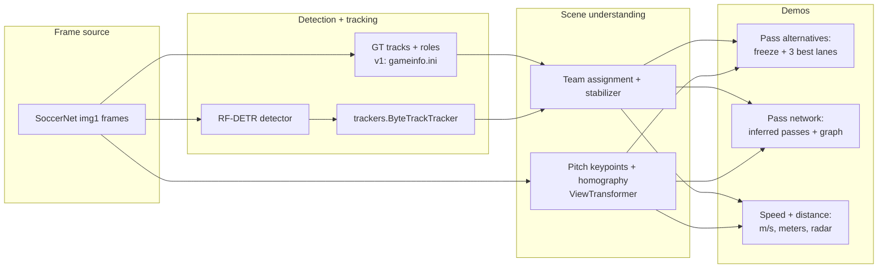

# World Cup Tracker Demos

**Single canonical copy:** `world_cup_projects/` (in the Roboflow monorepo or as its own
git root for publication). The duplicate export folder `world-cup-tracker-demos/` was
removed.

Two shareable football-analytics demos that promote the Roboflow
[`trackers`](https://github.com/roboflow/trackers) library, riding the World Cup hype.
Both reuse what we already built at Roboflow (`trackers`, RF-DETR,
[`roboflow/sports`](https://github.com/roboflow/sports)). **v2 demos** (detector +
pitch homography) run on **Bundesliga broadcast clips** in `bundesliga_videos/` — the same
domain the pitch-keypoint and player-detection models were trained on. **v1** can still
use **SoccerNet** game-state GT tracks when you want zero model weights.

1. **Pass Alternatives** — freeze the frame when a player has the ball and overlay the
   three best passing lanes.
2. **Pass Network** — infer completed passes and turnovers from tracking, score each pass
   with the same lane model, and render a collaboration web plus possession-lost banners.
3. **Player Speed & Distance** — per-player speed (km/h) and total distance covered, with
   on-pitch labels, an end-of-clip leaderboard, and a top-down radar minimap.

Status: **all three demos run end-to-end** and produce rendered MP4s.

## Which clips and why

**Default for v2 (`--video`, `--metric`):** short Bundesliga broadcast segments in
`bundesliga_videos/`. Pass `--video bundesliga_videos/<clip>.mp4` explicitly — there is
no auto-picker for local MP4s.

| Clip | Role |
|------|------|
| **`08fd33_0.mp4`** | Primary hero clip — stable pitch keypoints, good possession for pass network / alternatives |
| **`08fd33_8.mp4`** | Stress test — longer gaps, missing-ball bridges, airborne receptions |
| **`c01561_3.mp4`** | Camera / team-color edge cases (goal lock, jersey stabilizer) |

**Why Bundesliga, not SoccerNet, for homography:** the pitch keypoint model
(`football-field-detection-f07vi/15` via Roboflow Inference) and football player
detector were trained on
[DFL Bundesliga](https://www.kaggle.com/competitions/dfl-bundesliga-data-shootout)
broadcast frames. Radar, metric pass scoring, and speed all depend on a clean H — that
holds on Bundesliga clips and often breaks on SoccerNet game-state angles (wrong/missing
keypoints, domain gap). SoccerNet SNMOT sequences remain useful for **v1 GT-only** runs
(no detector weights) but are a poor default for `--metric`.

**SoccerNet auto-pick (optional):** `common.clips.rank_clips` can rank test sequences by
possession density when you use `--sequence SNMOT-*` without `--video`. That path is
legacy for pixel-space / GT demos — not recommended for pitch homography.

## Why SoccerNet (v1 only)

SoccerNet game-state clips (under `SOCCERNET_TRACKING_ROOT`, or the monorepo mirror at
`trackers metrics/soccernet/soccernet_data/tracking` when present) ship **ground-truth
tracks with role / team / jersey labels** (parsed from `gameinfo.ini`),
so v1 runs with zero model weights.

- 30s clips, `1920x1080`, 25 fps, 750 frames each (`seqinfo.ini`).
- `gt/gt.txt` is standard MOT: `frame,track_id,x,y,w,h,conf,-1,-1,-1`.
- `gameinfo.ini` maps each `track_id` to `player team left|right` / `goalkeeper` /
  `referee` / `ball` + jersey number. Parsed by [`common/soccernet.py`](common/soccernet.py).

## Architecture



### Two tiers

| Tier | Detection / tracking | Calibration | What it shows |
|------|----------------------|-------------|---------------|
| **v1** | SoccerNet GT tracks | image space / bbox-height | Pass lanes + approximate m/s — no weights |
| **v2** | football-players-detection + ByteTrack/BoTSORT | DFL pitch homography → `ViewTransformer` | True meters / m/s + top-down radar on Bundesliga clips |

## Folder layout

```
world_cup_projects/
  README.md
  requirements.txt
  world_cup_demos.ipynb        # walkthrough notebook
  common/
    soccernet.py               # GT loader (roles/teams/jersey -> sv.Detections)
    possession.py              # ball-carrier detection
    clips.py                   # auto-pick best clips
    geometry.py                # point-to-segment distance etc.
    pitch.py                   # ViewTransformer + pitch config + radar + PitchHomography
    teams.py                   # team assignment (Siglip TeamClassifier + GK resolution)
    detect.py                  # RF-DETR + ByteTrack pipeline (v2)
    visual.py                  # shared annotators, radar, HUD
  pass_alternatives/
    pass_options.py            # lane scoring (openness / forward / space)
    render.py                  # freeze-frame overlay video
    run.py                     # CLI
  player_stats/
    pass_events.py             # pass + turnover inference rules
    pass_network.py            # collaboration graph aggregation
    pass_network_render.py     # passes + alternatives + turnover video
    pass_network_run.py        # CLI
    carrier_tracking.py        # per-frame carrier debug timeline
    speed_distance.py          # per-track speed + cumulative distance
    render.py                  # speed labels + leaderboard + radar
    run.py                     # CLI
  weights/rfdetr/              # RF-DETR checkpoint cache (RF_HOME)
  .cache/models/               # pitch keypoint model
  assets/                      # rendered mp4s / json / stills (gitignored)
```

## Scene understanding (teams, radar, homography)

**Team colors (v2):** per-frame jersey KMeans assigns team 0/1. A
`TrackletTeamStabilizer` then locks each `tracker_id` and only flips after **8 consecutive**
disagreeing frames — this cuts outfield flicker on broadcast clips.

**Radar minimap:** per-frame `homography_from_keypoints_radar()` (sports-style fit from
accepted keypoints, confidence ≥ 0.9). No clip-wide mirror/orientation lock on display —
what you see matches [`roboflow/sports`](https://github.com/roboflow/sports) radar demos.

**Goal colors:** during warmup, outfield feet are clustered on pitch X; the team with lower
mean X defends the left goal. Goalkeepers are pinned to that side's defending team for the
clip (`warmup_goal_defenders_radar`).

**Metric pass scoring** (lane quality, pass length, speed) still uses the sequence
`PitchHomographyTracker` — smoother for distances, separate from the radar display H.

---

## Pass analytics — how we compute things

Football intuition first, then the exact gates. Pass alternatives and pass detection share
the same lane-scoring model (`pass_alternatives/pass_options.py`):

| Pipeline | Question it answers | When it runs |
|----------|---------------------|--------------|
| **Pass alternatives** | *What could the carrier play right now?* | Freeze frames on good moments |
| **Pass detection** | *Who actually passed to whom?* | Full-clip scan of carrier handoffs |
| **Turnover detection** | *Who lost the ball to the opponent?* | Same scan, rule 5 below |

### Foundation — who has the ball?

**Intuition:** possession means the ball is at someone's feet, not merely "close in 3D".
Aerial balls project onto the pitch as if they were on the ground, so we must reject fly-bys.

```
ball = ground position of ball detection
for each player:
    dist_px = distance(ball, player.feet)   # Y-axis stretched when |dy| > 10px
    dist_m  = homography distance (optional)
    valid   = (dist_px <= limit_px OR dist_m <= limit_m) AND NOT aerial
aerial    = |ball.y - feet.y| > 20px   # ball clearly above/below feet in image
carrier   = nearest valid player
```

- **Control** (tight, ~0.8 m / 55 px): ball glued to feet — dribbling.
- **Reception** (looser, ~1.8 m / 120 px): first contact / one-touch — wider gate.
- **Why aerial veto:** without it, balls flying over a player still pass the metric
  distance check and create false possession.

### A. Scoring pass alternatives (hypothetical lanes)

**Intuition:** a good pass option is *open along the line*, *forward*, and leaves the
receiver *free of nearby rivals*. We score every teammate and show the top 3.

For each teammate receiver `R` from carrier `C`:

```
length     = distance(C, R)
corridor   = strip along segment C→R (see rival width below)

openness   = min distance from any RIVAL inside corridor to the pass line
             (uses min(feet, bbox center) so leaning defenders count)
rivals     = count of opponents inside corridor

space      = distance from R to nearest opponent (anywhere, not just on the line)
forward    = dot(R - C, attack_direction)   # toward opponent goal in metric mode

score = 0.45 * norm(openness) + 0.30 * norm(max(forward, 0)) + 0.25 * norm(space)
        - teammate_lane_penalty
        - backward_penalty          # pass vs carrier run (see below)
        - backward_attack_penalty   # pass toward own goal (see below)
skip if length < 2 m or > 45 m
```

**Two backward penalties** (both can apply; they measure different things):

| Penalty | Reference axis | When it fires |
|---------|----------------|---------------|
| `backward_penalty` | Carrier **run** (recent Kalman velocity) | Pass aims behind where the player is moving (`pass · run < -0.15`) |
| `backward_attack_penalty` | **Attack** direction (toward opponent goal) | `forward < 0`, and (by default) carrier is running forward (`run · attack ≥ 0.15`) |

The attack-back gate skips deliberate retreats — e.g. a safety pass while the team is
already dropping. Turn it off (`backward_attack_only_when_running_forward=False`) to penalize
every backward pass regardless of motion.

**Rival corridor width** (metric, pitch space):

| Pass length | Full width | Why |
|-------------|------------|-----|
| ≤ 18 m | 2.5 m | base — short passes are narrow |
| 18–28 m | 3.25 m | stepped +0.75 m |
| > 28 m | 4.0 m | long switches need slack (capped at 4.5 m) |

Fixed tiers — not proportional to length — so very long balls don't get absurdly wide
corridors that forgive false positives.

**Teammate corridor:** 1.2 m (rivals use 2.5 m). Light penalty only when a teammate
blocks the narrow lane.

**When to freeze (pass alternatives demo):** score every possession frame offline; pick
frames that beat score thresholds, are local peaks (±12 frames), and are ≥ 90 frames apart.

**When to freeze (pass network, `--show-predictions`):** only on the **release frame** of
an inferred pass, when `quality_score` is not null, `quality_score >= --freeze-quality-threshold`
(default 0.0), the ball carrier is found, and `top_options` returns at least one lane.

### B. Detecting completed passes (retrospective)

**Intuition:** a pass is a *release* by player A and a *confirmed arrival* by teammate B
on the same team, with no opponent *control* in between. Each team keeps its own
release anchor (not one global anchor).

Per team, frame by frame (`player_stats/pass_events.py`):

```
RULE 1 — Valid touch
  ball nearest this player's feet
  reject aerial CONTROL (|ball.y - feet.y| > 20px)
  reject aerial RECEPTION only when ball is below feet (ball.y - feet.y > 40px)
  allow chest-height receptions (ball above feet)

RULE 2 — Passer (release anchor)
  outfield: 3 consecutive control frames, OR
  goalkeeper: 1 control/reception frame, OR
  any role: last valid touch within 10 frames when ball goes in-flight
            (covers GK punts and one-touch releases)

RULE 3 — Receiver
  3 consecutive valid touches by default (filters deflections / fly-bys)
  if gap passer→receiver ≥ 15 frames and touch is reception-only: 2 frames OK
  if gap passer→receiver < 15 frames: receiver must show 3 control frames
      (quick plays: reject ball skimming past a teammate)
  do not move release anchor to receiver until pass is evaluated

RULE 4 — Emit pass
  same team, frame gap in [1, 75], ball travel ≥ 1 m
  no opponent CONTROL between release and arrival
  dedupe duplicate passer→receiver within 12 frames
  score lane quality at release frame (same model as §A)
```

**Why each gate exists:**

| Gate | Problem it fixes |
|------|------------------|
| Aerial control veto | Ball overhead / below feet → false carrier |
| Reception below-feet veto | Long ball skimming under feet |
| Opponent-blocked arrival | Update release to interceptor without false pass |
| Nearest-player check | Tracker assigns ball to wrong ID when two players close |
| 3-frame arrival streak | Single-frame deflections counted as receptions |
| Adjacent-pass control | One-touch passes need real control at receiver |
| Pre-flight release window | GK punts only show 1 control frame before boot |
| Per-team anchors | Opponent anchor on team B was blocking team A passes |
| Opponent-between check | Don't credit teammate after interception |
| In-flight anchor survival | Ball visible but no player in range — don't lose passer |
| Missing-ball bridge | Ball not detected for ≤10 frames — keep release + arrival streak |
| Defer receiver confirm | Receiver control must not overwrite passer anchor pre-emit |
| Long-gap reception (2f) | Airborne receptions on gaps ≥15f |

### C. Detecting turnovers (interceptions)

**Intuition:** team A released the ball intending a pass; an opponent touched it before
any teammate of A arrived. Attribute the steal to the opponent's **first** valid touch.

```
RULE 5 — Emit turnover
  team A has a pending release
  on first opponent touch after release → snapshot (release_frame, passer_tid)
  when that opponent later completes a pass to a teammate:
      interception_frame = first valid touch by interceptor after snapshot
      require opponent CONTROL between release and that touch
      emit turnover(passer, interceptor, ...)
      clear team A's release anchor
```

Teammate arrival streaks are **ignored** if an opponent controlled the ball in between.

### D. Scoring a detected pass

Once a pass A→B is inferred, we re-run the lane scorer at the **release frame** with
carrier = A and look up receiver B. Stored fields: `quality_score`, `openness`,
`forward_gain`, `receiver_space`, `rivals_in_lane`, `length_m`.

- **`quality_score` is `null`** when the scorer cannot produce an option for that receiver
  (e.g. length out of range) — those passes are excluded from quality averages on the
  collaboration graph.
- **Strongest link** on the stats card is the undirected pair with the most passes, not
  an arbitrary first edge.

Same formula as §A — detected passes get a retrospective "how good was this lane?" score.

---

## Demo 1 — Pass Alternatives

Freezes on high-scoring possession moments and draws the top three ranked passing lanes
with corridor shading on video and the radar minimap.

In v1 the attacking direction is an image-space proxy (carrier-team centroid →
opponent-team centroid); with `--metric`, homography gives true direction-to-goal.

Pitch keypoints default to `--pitch-confidence 0.9`.

## Demo 2 — Pass Network

Full-clip pass and turnover inference, collaboration graph, optional alternative freezes
on release frames (`--show-predictions`). Output JSON lists `passes[]`, `turnovers[]`,
and per-link counts in `collaboration_links`.

| Flag | Effect |
|------|--------|
| `--render` | MP4 with pass arrows, collaboration web, turnover banner |
| `--show-predictions` | Insert pass-alternative freeze frames on scored release frames (§A) |
| `--freeze-quality-threshold` | Minimum `quality_score` for a freeze (default 0.0) |
| `--debug-carrier` | HUD: active carrier, release anchor, arrival streak |

Rules: **§B** (passes) and **§C** (turnovers).

## Demo 3 — Player Speed & Distance

1. Track every player (GT in v1, RF-DETR + `ByteTrackTracker` in v2); accumulate feet
   position per frame.
2. Convert pixel motion to meters:
   - **height** (default, no weights): bbox height (~1.8 m) gives a local meters-per-pixel
     scale.
   - **homography**: per-frame `ViewTransformer` maps feet to true pitch meters.
3. **Speed:** step distance / Δt, drop steps > 12.5 m/s. Optional upgrades:
   `--speed-upgrade-multi-lag`, `--speed-upgrade-adaptive-filter`,
   `--speed-upgrade-feet-smooth`, `--speed-display-smooth`.
4. Render km/h labels, end-card leaderboard, and radar minimap in homography mode.

Radar uses the sports-style per-frame H and goal-defender lock described above.

## Weights

- **Football players** (`football-player-detection.pt`, ~137 MB): same weights as
  [`football-players-detection-3zvbc`](https://universe.roboflow.com/roboflow-jvuqo/football-players-detection-3zvbc)
  (DFL-trained; classes: ball, goalkeeper, player, referee). Default for `--video` clips
  (e.g. `bundesliga_videos/08fd33_0.mp4`) which have **no SoccerNet-style GT tracks**.
  `common.detect.ensure_football_players_model()` downloads from Google Drive into
  `.cache/models/`.
- **RF-DETR**: auto-downloads on first use. Cache dir defaults to `~/.roboflow`; set
  `RF_HOME=world_cup_projects/weights/rfdetr` to keep it in-repo. Force `device="cpu"` on
  pre-macOS-14 machines (MPS otherwise errors).
- **Pitch keypoint model** — Roboflow Inference
  [`football-field-detection-f07vi/15`](https://universe.roboflow.com/roboflow-jvuqo/football-field-detection-f07vi/model/15)
  (trained on [DFL Bundesliga](https://www.kaggle.com/competitions/dfl-bundesliga-data-shootout)
  frames). Set `ROBOFLOW_API_KEY`; weights cache automatically on first run. Use
  `bundesliga_videos/` for metric demos, not SoccerNet SNMOT.

## Rendered outputs (in `assets/`, gitignored)

| File | Demo | Source / calibration |
|------|------|----------------------|
| `pass_network_football_metric_08fd33_0.mp4` | Pass network + radar (hero) | DFL detector + pitch H |
| `pass_alternatives_football_metric_08fd33_0.mp4` | Top-3 passing lanes, metric | DFL detector + pitch H |
| `pass_alternatives_gt_SNMOT-194.mp4` | Top-3 passing lanes, pixel space | SoccerNet GT (v1, no weights) |

Each MP4 ships a matching `.json` manifest (freeze events / leaderboard) and is
re-encoded to h264 (`ffmpeg -c:v libx264 -crf 23 -pix_fmt yuv420p`) for broad playback.

There is also a walkthrough notebook: [`world_cup_demos.ipynb`](world_cup_demos.ipynb).

---

## Commands

**Setup** (monorepo or standalone):

```bash
pip install -r world_cup_projects/requirements.txt
pip install -e trackers   # monorepo only
pip install -e ".[full]"  # standalone: cd world_cup_projects first

export ROBOFLOW_API_KEY=your_key   # pitch keypoints (Inference f07vi/15)
```

v2 extras: `rfdetr`, `ultralytics`, `gdown`, `inference` (included in `[full]`).

**Monorepo — v2 demos on Bundesliga** (`PYTHONPATH=.` from repo root):

```bash
# Pass network (primary demo) — inferred passes + turnovers + radar
PYTHONPATH=. python -m world_cup_projects.player_stats.pass_network_run \
    --video world_cup_projects/bundesliga_videos/08fd33_0.mp4 \
    --metric --render --show-predictions

# Pass alternatives — freeze frames + top-3 lanes
PYTHONPATH=. python -m world_cup_projects.pass_alternatives.run \
    --video world_cup_projects/bundesliga_videos/08fd33_0.mp4 --metric

# Homography debug: pitch keypoints + feet warp check
PYTHONPATH=. python -m world_cup_projects.pass_alternatives.run \
    --video world_cup_projects/bundesliga_videos/08fd33_0.mp4 --metric --debug-pitch-keypoints
```

**SoccerNet v1 (optional, needs `SOCCERNET_TRACKING_ROOT`):**

```bash
export SOCCERNET_TRACKING_ROOT=/path/to/soccernet/tracking

# GT tracks, pixel-space pass alternatives (no detector weights)
PYTHONPATH=. python -m world_cup_projects.pass_alternatives.run --sequence SNMOT-194

# Rank SoccerNet clips (legacy auto-pick)
PYTHONPATH=. python -m world_cup_projects.pass_alternatives.run --rank-only
```

## Credits

Built on [`trackers`](https://github.com/roboflow/trackers),
[RF-DETR](https://github.com/roboflow/rf-detr), `supervision`, and utilities vendored from
[`roboflow/sports`](https://github.com/roboflow/sports) (Apache-2.0): `ViewTransformer`,
`SoccerPitchConfiguration`, pitch annotators, and `TeamClassifier`.
